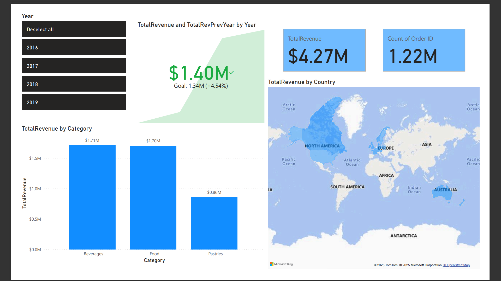
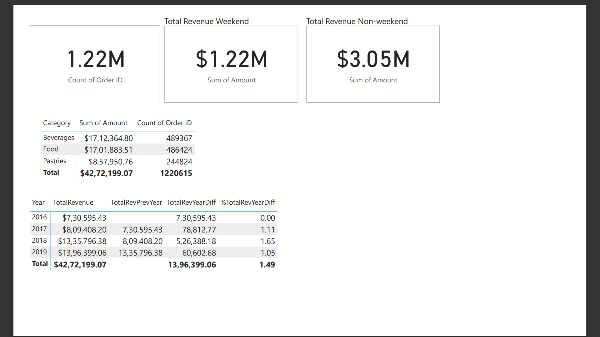
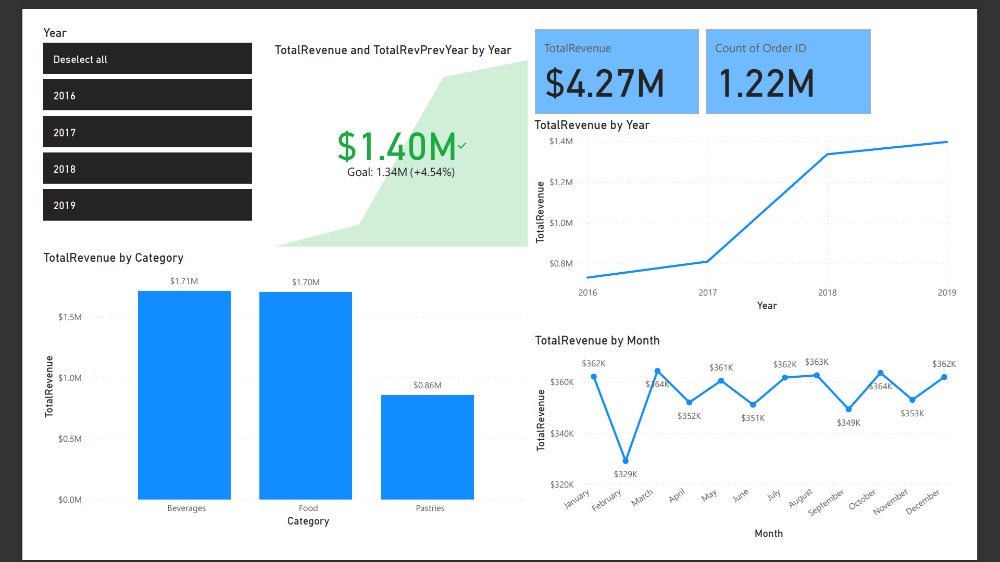
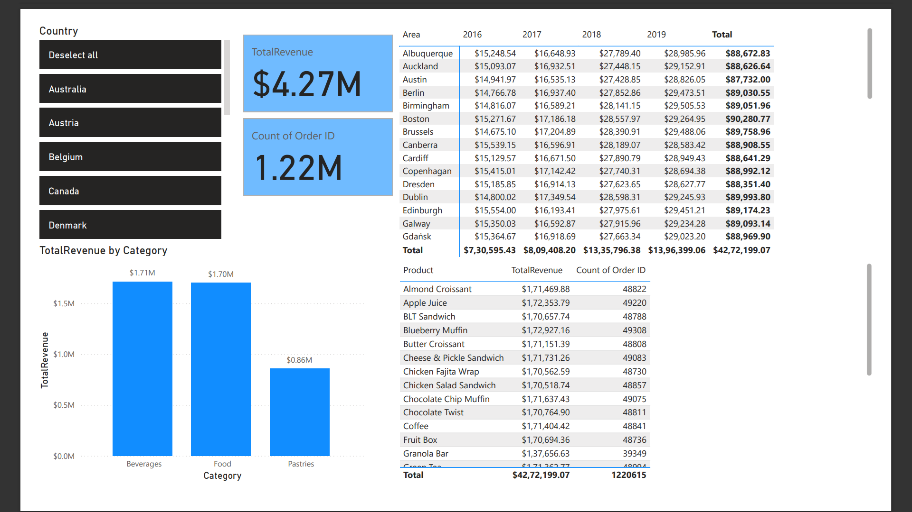

# Power-Bi-Projects-
Strategic financial  Insights Dashboard: Analyzing Food & Beverages Products, Seasonal and Geographic Trends
  
### Overview
  This repository contains a Power BI template (.pbit) file for a Strategic Financial Insights Dashboard. This dashboard is designed to analyze financial data for Food & Beverages products, with a focus on identifying and understanding Seasonal and Geographic Trends. The template includes the data model, queries, and report structure necessary to analyze key financial metrics such as revenue, profitability, and sales volume. It's ready to connect to your specific financial data sources.
  The dashboard serves as a central hub for business leaders, financial analysts, and marketing teams to make data-driven decisions. By visualizing key performance indicators (KPIs) and trends, it helps to answer crucial business questions, such as
  - Which product categories are most profitable?
  - How do sales and revenue fluctuate throughout the year?
  - Are there specific regions that are underperforming or overperforming?
  - What is the impact of seasonality on our inventory and marketing strategies?

### Key Features & Analysis
  The dashboard is structured to provide a multi-layered view of the business performance:
  #### Product Performance Analysis:
  - Profitability Metrics: Revenue and sales performance.
  - Category Breakdown: Compare the performance of different food and beverage categories (e.g., packaged goods, beverages, fresh produce).
  #### Seasonal Trend Analysis:
  - Time-Series Charts: Visualize monthly, quarterly, and yearly trends for sales, revenue, and profit.
  - Seasonal Patterns: Identify clear peaks and troughs in sales, allowing the business to anticipate demand and optimize inventory.
  - Year-over-Year (YoY) Growth: Compare current year performance against previous years to measure growth and identify long-term trends.
  #### Geographic Analysis:
  - Sales by Region: Use a map visualization to show sales performance by country, state, or city.
  - Regional Profitability: Compare the profitability of different markets to identify high-margin regions.
  - Market Penetration: Assess the strength of the business in various geographic areas.

### Technical Details
  Platform: Power BI Desktop
  Output: Power BI Template (.pbit) file
  Data Model: A star schema model with a central Fact_Sales table and dimension tables for Products and Geographic_Location.
  Data Sources: Designed to connect to various data sources, including but not limited to:
  SQL Databases (e.g., Sales and Order data)
  Excel or CSV files (e.g., Product Lists, Price Lists)
  Measures & Calculations: Includes custom DAX measures for calculating profitability, growth rates, and other key metrics.

### Product performance 
  
### Seasonal Trend Analysis

### Revenue performance Analysis by country & category

### 

